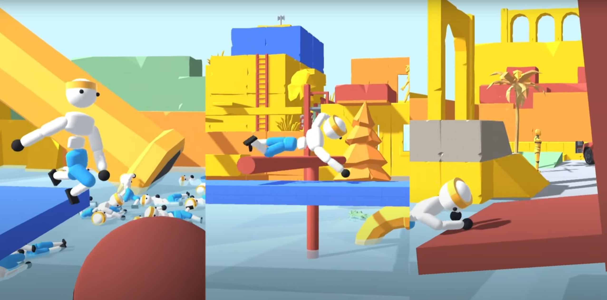
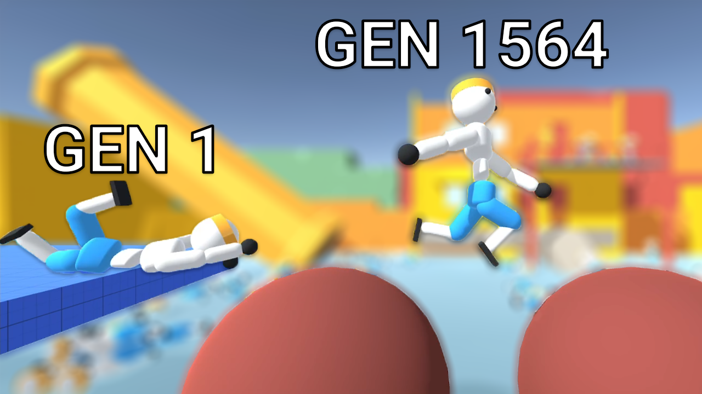

# Total Wipeout AI

  

Training an AI for Total Wipeout using Unity MLAgents

YouTube Devlog available here:

  

## Usage

This is a fork of the MLAgents repo. Follow their [Getting Started](https://github.com/Unity-Technologies/ml-agents/blob/release_20_docs/docs/Getting-Started.md) to use this fork.

The Total Wipeout Scripts, Scenes, and Models are in the `Project/Assets/ML-Agents/Examples/WalkerProject/Assets/ML-Agents/Examples/Walker/` folder.
- `Scenes` contains 3 Unity scenes for each of the three obstacles; **the background of these scenes requires a paid, non-included asset called `PolygonPrototype`**
- `Scenes` also contains a `Trainer` scene to train on the `Balls` obstacle in parallel
- `Models` contains a variety of trained models
- `Scripts/WalkerAgent.cs` contains the code for the Agent